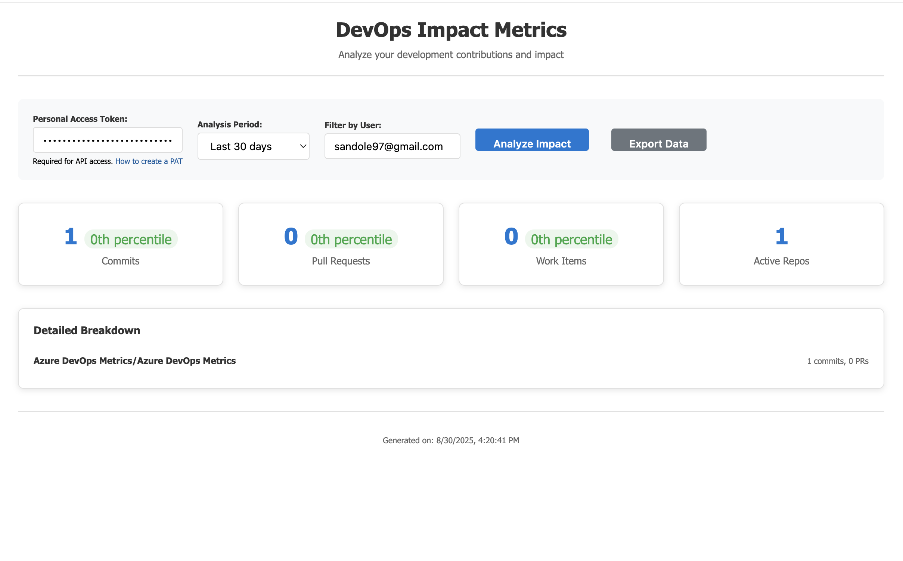

# DevOps Impact Metrics Extension

**Analyze your development impact across Azure DevOps repositories, pull requests, and work items directly in the Azure DevOps interface.**

## 🚀 Features

- **📊 Comprehensive Metrics**: Track commits, pull requests, and work items
- **🎯 User-Specific Analysis**: Filter by specific team members or analyze all activity
- **📈 Visual Dashboard**: Clean, intuitive interface with key metrics
- **⏰ Flexible Time Ranges**: Analyze from 7 days to 6 months of activity
- **📁 Data Export**: Export your metrics data for further analysis
- **🔍 Repository Insights**: See which repositories have the most activity
- **🏆 Top Contributors**: Identify the most active repositories and contributors

## 📸 Screenshots

Example view:

## 🎯 Use Cases

- **Individual Contributors**: Track your personal productivity and impact
- **Team Leads**: Monitor team activity across projects and repositories
- **Project Managers**: Get insights into development velocity and resource allocation
- **DevOps Engineers**: Analyze repository activity patterns and trends

## 📋 Prerequisites

- Azure DevOps organization with appropriate permissions
- Access to the repositories and work items you want to analyze

## 🔧 Installation

1. Visit the [Visual Studio Marketplace](https://marketplace.visualstudio.com/azuredevops)
2. Search for "DevOps Impact Metrics"
3. Click "Get it free" and install to your Azure DevOps organization
4. The extension will appear as "Impact Metrics" in the Repos section

## 🎮 How to Use

1. **Navigate to Impact Metrics**: Go to Repos → Impact Metrics in your Azure DevOps project
2. **Select Time Period**: Choose your analysis timeframe (7 days to 6 months)
3. **Filter by User** (Optional): Enter an email address to focus on specific contributor
4. **Click "Analyze Impact"**: The extension will gather data across your organization
5. **View Results**: See your metrics dashboard with detailed breakdowns
6. **Export Data**: Use the "Export Data" button to download your metrics as JSON

## 📊 Metrics Explained

### Core Metrics
- **📝 Commits**: Total number of commits (filtered by user if specified)
- **🔄 Pull Requests**: All pull requests in the analyzed repositories
- **📋 Work Items**: Work items assigned to the specified user
- **📂 Active Repos**: Number of repositories with activity in the period

### Repository Breakdown
- Lists the most active repositories by total activity
- Shows commits and pull requests per repository
- Helps identify where development effort is concentrated

## 🔒 Permissions Required

This extension requires the following Azure DevOps permissions:
- **Code (read)**: To access repository commits and pull requests
- **Work Items (read)**: To access work item assignments
- **Project (read)**: To access project information

## 🛠️ Technical Details

- Built using the Azure DevOps Extension SDK
- Uses Azure DevOps REST APIs for data collection
- Responsive design that works on desktop and mobile
- No data is stored outside of your Azure DevOps organization

## 🆘 Support & Issues

Having trouble with the extension? Here's how to get help:

1. **Check Common Issues**: See the troubleshooting section below
2. **Report Issues**: [Create an issue on GitHub](https://github.com/yourusername/azure-devops-metrics-extension/issues)
3. **Contact Support**: Email support@yourcompany.com

## 🔧 Troubleshooting

### "Failed to fetch projects" Error
- Verify your Azure DevOps permissions include project access
- Check if your organization allows third-party extensions

### No Commits Showing
- Ensure the email address matches exactly with your Git configuration
- Check if you have commits in the selected time period
- Verify repository access permissions

### Work Items Not Appearing
- Confirm work items are assigned to the specified email address
- Check if work items were created in the selected time period
- Verify work item read permissions

## 🔄 Updates & Changelog

### Version 1.0.0
- Initial release
- Core metrics functionality
- Repository breakdown
- Data export capability

## 🤝 Contributing

We welcome contributions! To contribute:

1. Fork the repository
2. Create a feature branch
3. Make your changes
4. Submit a pull request

## 📄 License

This extension is licensed under the MIT License. See the [LICENSE](LICENSE) file for details.

## 🙏 Acknowledgments

- Built on the Azure DevOps Extension SDK
- Inspired by the need for better developer productivity insights
- Thanks to the Azure DevOps community for feedback and testing

---

**Made with ❤️ for the Azure DevOps community**

*Transform your development metrics into actionable insights*